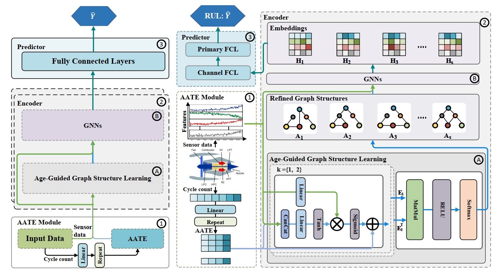

# Aging-Informed Graph Convolutional Networks for Aero-Engine Health Prognosis

**AIGCN-RUL** (Aging-Informed Graph Convolutional Network for Remaining Useful Life Estimation) is a unified framework that formulates RUL prediction as an **aging-aware graph learning** problem. The method integrates degradation priors with dynamic inter-sensor dependencies using temporal embeddings and graph neural networks.

<p align="center">
  
</p>

---

## Results

AIGCN-RUL is evaluated against 9 state-of-the-art baselines, including Dual-Mixer, DA-Transformer, FCSTGNN, and others.
Our method consistently outperforms all baselines on both C-MAPSS and N-CMAPSS datasets in terms of RMSE and Score.

CMAPSS result:
<p align="center">

</p>
N-CMAPSS result:
<p align="center">

</p>

## Data

The data can be downloaded here.

NASA CMAPSS Jet Engine Simulated Data: (https://catalog.data.gov/dataset/cmapss-jet-engine-simulated-data)
NASA CMAPSS Jet Engine Simulated Data: (https://ti.arc.nasa.gov/tech/dash/groups/pcoe/prognostic-data-repository/)

Place the dataset folder inside the project root (or update the data path in your script accordingly).

## 🔧 Requirements

- Python 3.8.19  
- NumPy 1.24.4  
- pandas 1.5.3  
- scikit-learn 0.24.0  
- PyTorch 1.8.2 + cu111  

Install all dependencies with:
```
pip install -r requirements.txt
```


### Train & Evaluate
```
python ./main.py
```

## Acknowledgement
We appreciate the following GitHub repos a lot for their valuable code and efforts.

- FCSTGNN (https://github.com/Frank-Wang-oss/FCSTGNN)
- Dual-Mixer-RUL (https://github.com/fuen1590/PhmDeepLearningProjects)

